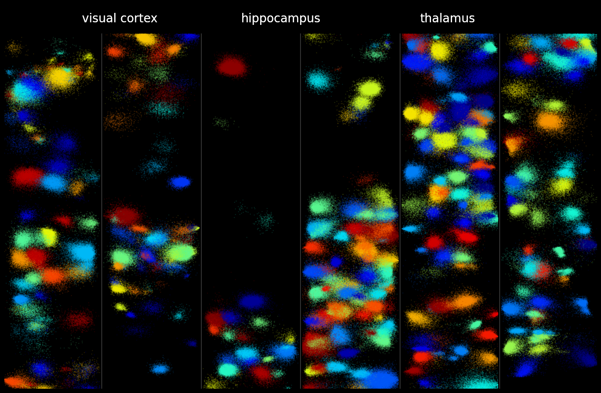

# Kilosort3: spike sorting on GPUs with template matching, drift correction and a new clustering method

For older versions, please see Github releases:   

* [Kilosort 2.5](https://github.com/MouseLand/Kilosort/releases/tag/v2.5) on Jan 30, 2021.
* [Kilosort 2.0](https://github.com/MouseLand/Kilosort/releases/tag/v2.0) on Oct 28, 2020.



Welcome to Kilosort3, a MATLAB package for spike sorting electrophysiological data up to 1024 channels. In many cases, and especially for Neuropixels probes, the automated output of Kilosort3 requires minimal manual curation. The main change from v2.5 is a completely new and much more sophisticated clustering algorithm, which we will document soon. To learn about Kilosort2.5, the primary reference is the Neuropixels 2.0 [paper](https://www.biorxiv.org/content/10.1101/2020.10.27.358291v1). The Github wiki still refers to Kilosort2, and it will be updated. 

Kilosort2.5 improves on Kilosort2 primarily in the type of drift correction we use. Where Kilosort2 modified templates as a function of time/drift (a drift **tracking** approach), Kilosort2.5 corrects the raw data directly via a sub-pixel registration process (a drift **correction** approach). Kilosort2.5 has not been as broadly tested as Kilosort2, but is expected to work out of the box on Neuropixels 1.0 and 2.0 probes, as well as other probes with vertical pitch <=40um. For other recording methods, like tetrodes or single-channel recordings, you should test empirically if v2.5 or v2.0 works better for you (use the "releases" on the github page to download older versions). 

Kilosort2 can still be accessed by downloading the release "Kilosort 2.0". It improves on the original Kilosort primarily by employing drift correction, which changes the templates continuously as a function of drift. Drift correction does not depend on a particular probe geometry, but denser spacing of sites generally helps to better track neurons, especially if the probe movement is large. Kilosort2 has been primarily developed on awake, head-fixed recordings from Neuropixels 1.0 data, but has also been tested in a few other configurations. To get a sense of how probe drift affects spike sorting, check out our "eMouse" simulation [here](https://github.com/MouseLand/Kilosort2/tree/master/eMouse_drift) and [its wiki page](https://github.com/MouseLand/Kilosort2/wiki/4.-eMouse-simulator-with-drift).

To aid in setting up a Kilosort2/2.5 run on your own probe configuration, we have developed a [graphical user interface](https://github.com/MouseLand/Kilosort/wiki/1.-The-GUI) where filepaths can be set and data loaded and visually inspected, to make sure Kilosort2/2.5 sees it correctly. The picture above is another GUI visualization: it shows the templates detected by Kilosort2 over a 60ms interval from a Neuropixels recording. The final output of Kilosort2/2.5 can be visualized and curated in the [Phy GUI](https://github.com/kwikteam/phy), which must be installed separately. Since Phy is in Python, you will also need the [npy-matlab](https://github.com/kwikteam/npy-matlab) package.

## Installation

Requirements:

* MATLAB >= R2016b
* MATLAB Toolboxes:
  * Parallel Computing Toolbox
  * Signal Processing Toolbox
  * Statistics and Machine Learning Toolbox
* An NVIDIA GPU and CUDA capabilities

You must run and complete successfully `mexGPUall.m` in the `CUDA` folder. This requires mexcuda support, which comes with the parallel computing toolbox. To set up mexcuda compilation, install the exact version of the CUDA toolkit compatible with your MATLAB version (see [here](https://www.mathworks.com/help/distcomp/gpu-support-by-release.html)). On Windows, you must also install a CPU compiler, for example the freely available [Visual Studio Community](https://www.visualstudio.com/vs/older-downloads/). You may need to check that the version of Visual Studio you install is compatible with your version of CUDA. If you had previously used a different CPU compiler in MATLAB, you must switch to the CUDA-compatible compiler using `mex -setup C++`. For more about mexcuda installation, see these [instructions](http://uk.mathworks.com/help/distcomp/mexcuda.html).

### General instructions for running Kilosort2

#### Option 1: Using the GUI

Navigate to the `Kilosort` directory and run `kilosort`:

```bash
>> cd \my\kilosort\directory\
>> kilosort
```
See the [GUI documentation](https://github.com/MouseLand/Kilosort/wiki/1.-The-GUI) for more details.

#### Option 2: Using scripts (classic method)

1. Make a copy of `main_kilosort.m` and `\configFiles\StandardConfig_MOVEME.m` and put them in a different directory. These files will contain your own settings, and you don't want them to be overwritten when you update Kilosort.  
2. Generate a channel map file for your probe using `\configFiles\createChannelMap.m` as a starting point.
3. Edit the config file with desired parameters. You should at least set the file paths `ops.fbinary`, `ops.root` and `ops.fproc` (this file will not exist yet - `kilosort` will create it), the sampling frequency `ops.fs`, the number of channels in the file `ops.NchanTOT` and the location of your channel map file `ops.chanMap`.
4. Edit `main_kilosort.m` so that the paths at the top ([lines 3–4](https://github.com/MouseLand/Kilosort/blob/main/main_kilosort.m#L3-L4)) point to your local copies of those GitHub repositories, and so that the configuration file is correctly specified ([lines 6–7](https://github.com/MouseLand/Kilosort/blob/2fba667359dbddbb0e52e67fa848f197e44cf5ef/main_kilosort.m#L6-L7)).

### Parameters

If you are unhappy with the quality of the automated sorting, try changing one of the main parameters:

`ops.Th = [10 4]` (default). Thresholds on spike detection used during the optimization `Th(1)` or during the final pass `Th(2)`. These thresholds are applied to the template projections, not to the voltage. Typically, `Th(1)` is high enough that the algorithm only picks up sortable units, while `Th(2)` is low enough that it can pick all of the spikes of these units. It doesn't matter if the final pass also collects noise: an additional per neuron threshold is set afterwards, and a splitting step ensures clusters with multiple units get split.

`ops.AUCsplit = 0.9` (default). Threshold on the area under the curve (AUC) criterion for performing a split in the final step. If the AUC of the split is higher than this, that split is considered good. However, a good split only goes through if, additionally, the cross-correlogram of the split units does not contain a big dip at time 0.

`ops.lam = 10` (default). The individual spike amplitudes are biased towards the mean of the cluster by this factor; 50 is a lot, 0 is no bias.

A list of all the adjustable parameters is in the example configuration file.

## Integration with Phy GUI

Kilosort2 provides a results file called `rez`, where the first column of `rez.st`are the spike times and the second column are the cluster identities. It also provides a field `rez.good` which is 1 if the algorithm classified that cluster as a good single unit. To visualize the results of Kilosort2, you can use [Phy](https://github.com/kwikteam/phy), which also provides a manual clustering interface for refining the results of the algorithm. Kilosort2 automatically sets the "good" units in Phy based on a <20% estimated contamination rate with spikes from other neurons (computed from the refractory period violations relative to expected).

Because Phy is written in Python, you also need to install [npy-matlab](https://github.com/kwikteam/npy-matlab), to provide read/write functions from MATLAB to Python.

Detailed instructions for interpreting results are provided [here](https://github.com/kwikteam/phy-contrib/blob/master/docs/template-gui.md). That documentation was developed for Kilosort1, so things will look a little different with Kilosort2.

## Credits

Kilosort2 by Marius Pachitariu  
GUI by Nick Steinmetz  
eMouse simulation by Jennifer Colonell  

## Questions

Please create an issue for bugs / installation problems.

## Licence

This program is free software; you can redistribute it and/or modify it under the terms of the GNU General Public License as published by the Free Software Foundation; either version 2 of the License, or (at your option) any later version.

This program is distributed in the hope that it will be useful, but WITHOUT ANY WARRANTY; without even the implied warranty of MERCHANTABILITY or FITNESS FOR A PARTICULAR PURPOSE. See the GNU General Public License for more details.

You should have received a copy of the GNU General Public License along with this program. If not, see <http://www.gnu.org/licenses>.
